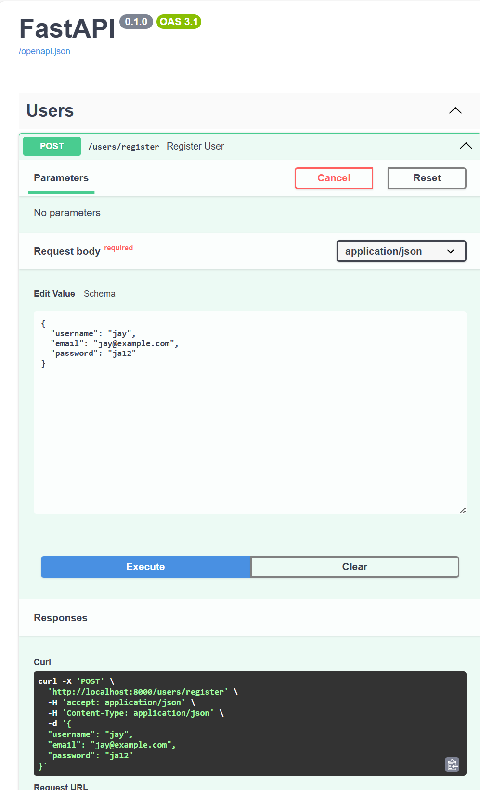
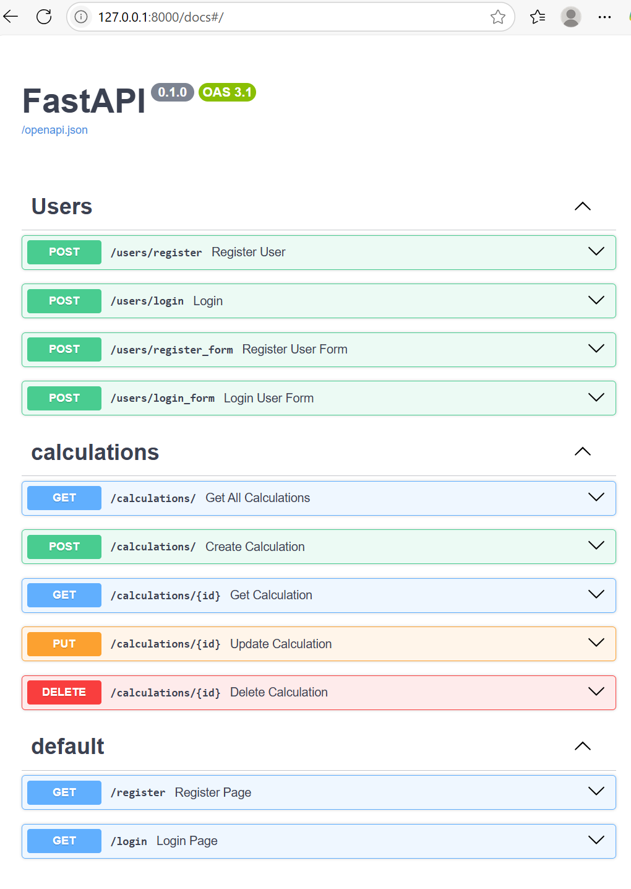
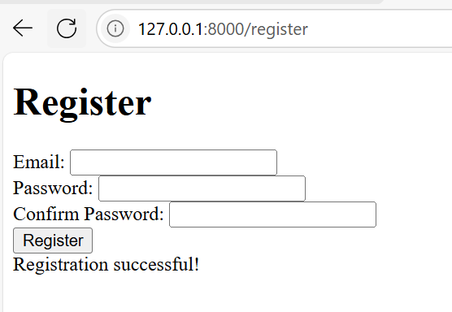
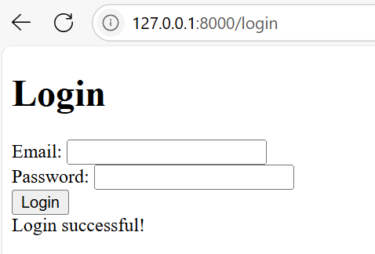
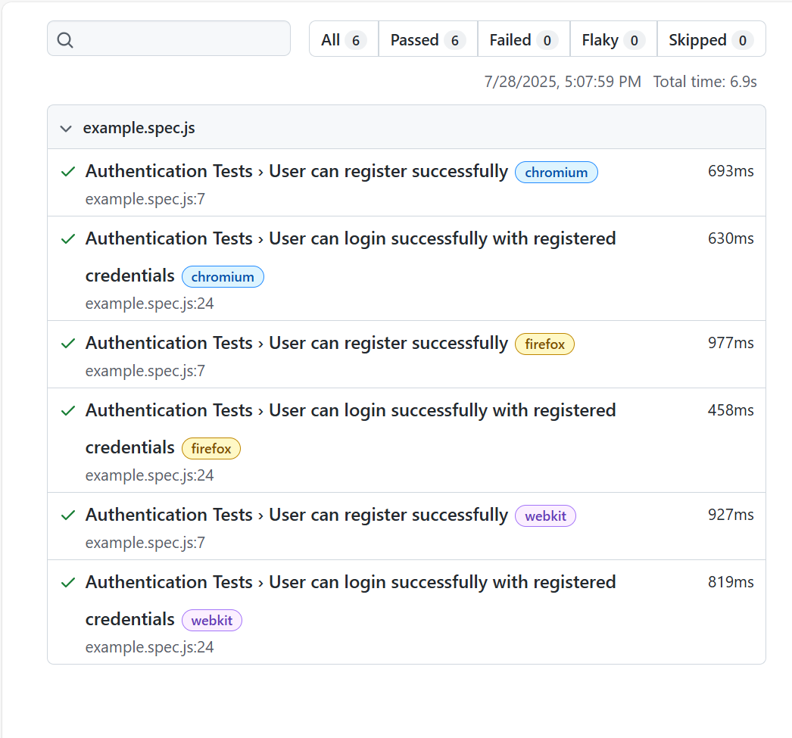
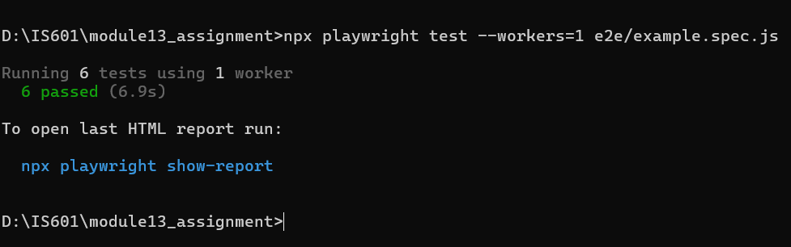
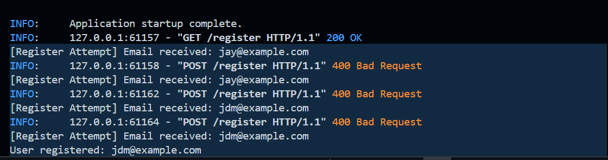

# 📦 Module 13 – FastAPI Auth App with Docker & E2E Testing

## 🔗 GitHub Repository

👉 [GitHub Repo Link](https://github.com/jaydrava/fastapi-jwt-app.git)

## 🐳 Docker Hub Image

👉 [Docker Hub Repo](https://hub.docker.com/repository/docker/jaydrava/module13-app)

---

## 🚀 How to Run the Application Locally

### 🔧 Requirements

- Docker + Docker Compose installed
- Node.js & npm installed (for Playwright E2E testing)

### 🐳 Step 1: Start App Using Docker Compose

```bash
docker-compose up --build
```
This spins up:

-   FastAPI backend with JWT-based authentication

-   SQLite database

-   Exposes the app at: http://localhost:8000

🔐 App Functionality
- Register and Login pages using JWT tokens

- Protected routes

- Frontend using Jinja2 templates

- User-friendly error handling

🧪 Running End-to-End (E2E) Tests with Playwright
### Step 1: Install Playwright dependencies
```bash
npm install
npx playwright install
```
### Step 2: Run the tests
```bash
npx playwright test
```
### Step 3: View test report
```bash
npx playwright show-report
```

⚙️ GitHub Actions CI/CD Pipeline
On every push to the main branch:

- GitHub Actions launches Docker Compose services.

- Runs all Playwright E2E tests.

- If tests pass, pushes the latest Docker image to Docker Hub.

Workflow file: .github/workflows/ci.yml

Playwright test workflow (optional): .github/workflows/playwright.yml

📸 Screenshots (inside screenshot/ folder)
✅ ``









